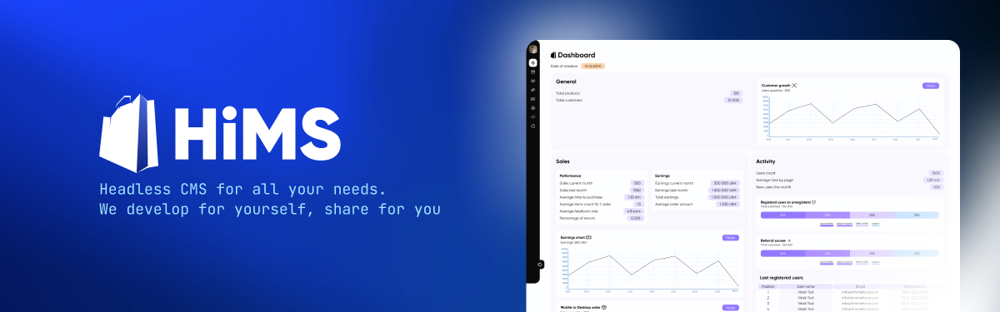

# HiMS

> [!IMPORTANT]  
> This is beta version of HiMS

## Preparing for a fly

Download and install [Node.js](https://nodejs.org/en/download/package-manager)

Download and install [Docker](https://docs.docker.com/engine/install)

### Initialization

Run `npm create hims@latest` and then `cd your_project_directory`

Run `npm link` to link hims executable

Run `hims init` and follow the instructions to init app or use `--default` flag to initialize all variables. All variables can be edited in `.hims.env` file in root directory.

### Starting Up

Run `hims start` to start the app.

### Stoping

Run `hims stop` to stop the app.

## Docs

Here you can find our API DOCS - https://hims-docs.himmelforce.com/

## Who are we?

We are a small team from Ukraine specializing in web application development. Naturally, we are inspired by what we do. Development has given us the chance to create. But I suspect that’s not what matters most to you right now. So, let’s get to the point—At some point, we realized that to develop quickly and with quality, universal solutions like content management systems were needed. We don't consider website builders or auxiliary tools; they don't scale for our needs, lack extensibility, and haven't earned our trust. Our quality standards have always been high, which has occasionally held us back. Our team has worked with many CMSs, especially those based on PHP. Many didn’t suit us due to their monolithic structure, limited extensibility, or unnecessary complexity. To be honest, technology itself was often a limiting factor. The answer we found was headless CMS. It provided flexibility, but compared to previous systems, it lacked functionality—many were essentially API wrappers. Combining our previous experience, we decided to take a risk. We began the journey of creating an ideal, simple, and flexible CMS that could scale to fit any web application and meet diverse needs. We have big, ambitious plans. Every user is a building block in creating a unique solution. We believe in our ideas and will gradually bring them to life.
